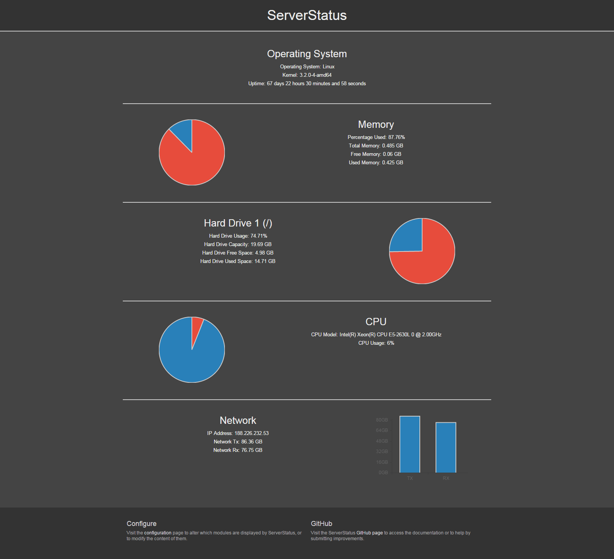

# ServerStatus
A lightweight, mobile friendly PHP web interface for basic monitoring of system resources on Linux servers.



## Project Aims
This project started off as a basic test of the functionality of [Chart.js](https://github.com/nnnick/Chart.js/), however I thought that it had promise as a new homepage for a Raspberry Pi based home server I use. As such, please note that this project will not offer system monitoring anywhere near as detailed as that offered by projects such as Monitorix, or many other popular system monitors. It will, however, offer at a glance information regarding resource usage, which, while not terribly useful for troubleshooting purposes, can offer interesting information about the status of your server. If you know basic HTML, the page can be modified to add a custom header to integrate it with your own site should you wish to use it in the same way I do.

## Testing
ServerStatus depends on a number of system files being in the right place. It has been tested on recent Debian based distributions, including Debian 6 and above, Ubuntu 12.04 and above, and a number of recent Raspbian builds. Other distributions should work just fine, but if you notice anything wrong on another distro please let me know!

On the client side, all modern HTML5 capable desktop and mobile browsers I've tested it on work just fine, but I have made absolutely no attempt to make it compatible with older versions of IE. [Sorry about that](https://www.google.com/chrome/browser/desktop/index.html).

## Installation
ServerStatus requires PHP to be installed on the server in order to work. There are a number of guides on the internet showing how to set up PHP for your preferred web server. PHP5 is strongly recommended, but earlier versions might work too.

To install ServerStatus, clone this repository into your web-accessible directory using the following command :
```
git clone https://github.com/dan142/ServerStatus.git
```

You must then set the appropriate permissions on the conf.ini file, so that it can be both accessed and written to by ServerStatus. Skipping this step will lead to an inability to configure the page to your liking. To do this, simply 'cd' into the newly created ServerStatus directory and run the following command:
```
sudo chmod 666 conf.ini
```

It will then be accessible and fully functional at "[yourdomain]/[yourdirectory]/ServerStatus", but you can copy the files wherever you like.

## Configuration
There are some ways you can configure ServerStatus to best suit your needs by visiting the configuration page accesible from the footer. It allows you to show and hide sections of the page, and change some of the things that are measured.
